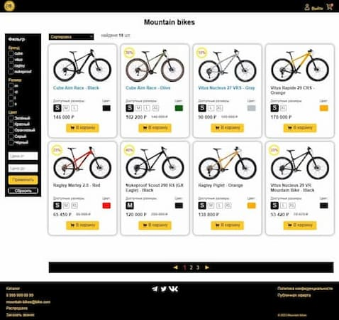
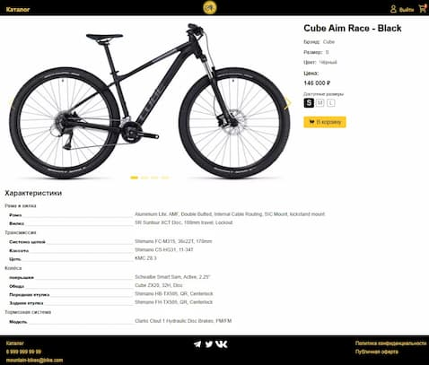
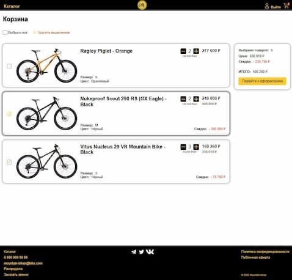
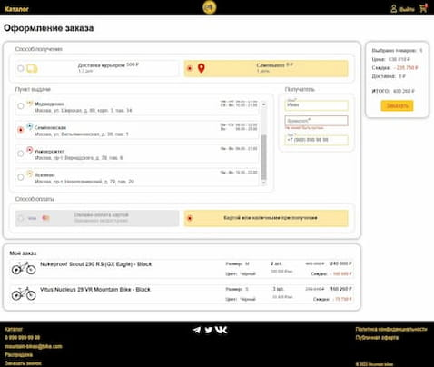

# Интернет-магазин Bike shop

## Скриншоты

|  |  |
| - | - |
|  |  |

## Технологии

- Vue 3 Composition API
- Vue-router
- Pinia
- Vite
- TypeScript
- Scss
- Axios
- Swiper.js

## Функционал

- Фильтрация и сортировка товаров: Реализованы фильтры по бренду, размеру, цвету и цене, а также возможность сортировки товаров по цене для удобства поиска.
- Добавление в корзину: Пользователи могут легко добавлять товары в корзину как со страницы списка товаров, так и с детальной страницы товара.
- Детальная страница товара: Каждый товар имеет свою детальную страницу с подробным описанием характеристик, галереей изображений и возможностью добавления в корзину.
- Управление корзиной: На странице корзины пользователи могут изменять количество товаров, выделять товары для оформления заказа и удалять ненужные позиции.
- Авторизация и регистрация: Для доступа к страницам корзины и оформления заказа требуется авторизация. Пользователям предоставляется возможность зарегистрироваться или войти в систему через модальное окно.
- Оформление заказа: Пользователи могут выбирать между доставкой по указанному адресу или самовывозом из представленных точек. Все данные, введенные пользователем, проходят валидацию для обеспечения корректного оформления заказа.
- Улучшенный пользовательский опыт: Предотвращена возможность чрезмерного нажатия на кнопки изменения количества товаров, а также предусмотрено ограничение доступа к страницам корзины и оформления заказа неавторизованным пользователям через адресную строку браузера.
- Поддержка спиннера при загрузке данных: Все запросы на сервер сопровождаются прелоадером, что обеспечивает плавный пользовательский опыт.
- Модальные окна блокируют выход фокуса за их пределы и обеспечивают удобную навигацию с клавиатуры.
- Адаптивная верстка: использованы медиа-запросы, Grid и Flexbox для обеспечения оптимального отображения на различных разрешениях экрана

## Демо
http://147.45.183.40

## Запуск проекта

```bash
# Установка зависимостей
npm install

# Запуск проекта в режиме разработки с hot-reload
npm run dev

# Компиляция проекта для prodaction
npm run build